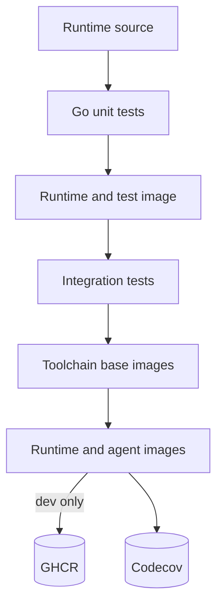
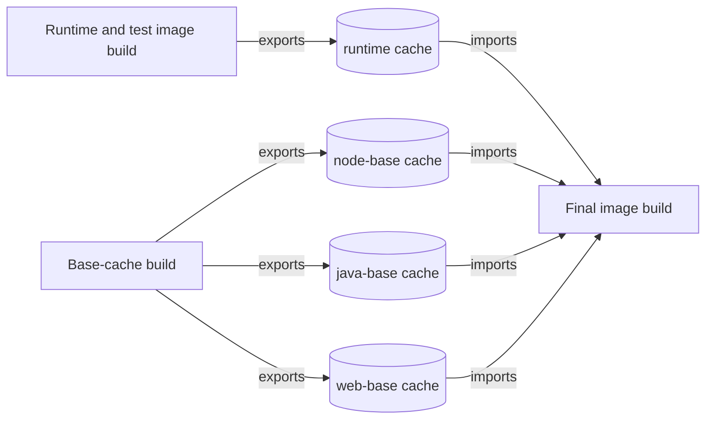

# Continuous Integration

CI verifies runtime code, builds container images, runs integration tests, and publishes development images from `dev`. It keeps shared build layers warm so routine changes do not pay full dependency-install cost.

## Workflow

Pipeline runs in one job:

1. Checks out source, sets up Go and Buildx, then calculates runtime build version
2. Runs unit tests with coverage and builds `runtime` plus `test` Bake targets
3. Runs integration tests against loaded test image
4. Builds shared toolchain base targets to refresh BuildKit caches
5. Builds runtime plus all agent images. On `dev`, it also publishes them to GHCR
6. Uploads the unit-test coverage report to Codecov



Builds use plain BuildKit output, making cache hits and misses visible in job logs.

## Caching

CI stores BuildKit records in GitHub Actions cache scopes. Each final image imports every scope used by its dependency chain. For example, Java images import Java, Node, and runtime caches; web images import web, Node, and runtime caches.



Scopes follow image dependency graph. Shared dependency installs sit below stable parents, and runtime copies happen after expensive base image setup. Cache-warming targets therefore produce records final image builds can reuse.

CI exports shared runtime and toolchain caches because many images consume them. It does not export any agent npm-install layers. Rebuilding those layers in parallel costs less than exporting and restoring their large, volatile cache records.

> [!NOTE]
> Cache availability does not guarantee a hit. BuildKit also needs matching inputs, build arguments, parent filesystem, and solve graph. Reproducible layers make those records dependable across runs.

Changes rebuild only affected image families:

- Codex changes rebuild Codex images; Claude changes rebuild Claude images.
- Java changes rebuild Java images; Playwright MCP changes rebuild web images.
- Node.js changes rebuild every agent image.
- MIPE runtime changes rebuild final agent layers while Node, Java, and web dependency layers remain cacheable.

## Publishing

Only pushes to `dev` publish images. CI authenticates to `ghcr.io` with GitHub-provided credentials and publishes under `ghcr.io/<owner>/mipe-runtime`.

Publishing rewrites timestamps in exported layers. Without a fixed `SOURCE_DATE_EPOCH`, that would give unchanged files a new timestamp on every build or commit, changing layer digests for no useful reason. Fixed epoch keeps those timestamps stable. 

Together with pinned build inputs from Bake and generated-cache cleanup, unchanged layers keep the same digest and GHCR can reuse existing blobs instead of receiving large duplicate uploads.

## Versioning

CI uses three complementary identifiers to describe a build. The build version identifies the runtime source revision and is embedded into the binary, for example:

```text
dev-4a8d2c1
```

Image tags provide convenient registry references for pulling images. They may move over time as newer builds are published, for example:

```text
ghcr.io/<owner>/mipe-runtime:dev-latest
ghcr.io/<owner>/mipe-runtime:dev-4a8d2c1
```

Image digests uniquely identify the published OCI image contents. Unlike tags, digests are immutable and always refer to exactly one published image, for example:

```text
ghcr.io/<owner>/mipe-runtime@sha256:abc123...
```

Build version is computed by a local script. Hash includes `go.mod`, `go.sum`, and production Go files under `cmd/` and `internal/`.

Tests do not contribute to the build version and are excluded from the Docker build context. Test-only changes still run checks but do not rebuild the runtime binary layer. Production Go source or module changes produce a new version and invalidate layers that depend on the binary.

## Triggering

CI supports manual runs and pushes to `main` or `dev`. Pushes run only when changes affect CI configuration or runtime build inputs: runtime commands, internal code, integration tests, Go modules, Docker files, hooks, Bake files, or Compose configuration.

Path filtering avoids image builds for unrelated repository changes. Manual dispatch remains available for cache checks, publishing validation, and other CI investigations.
