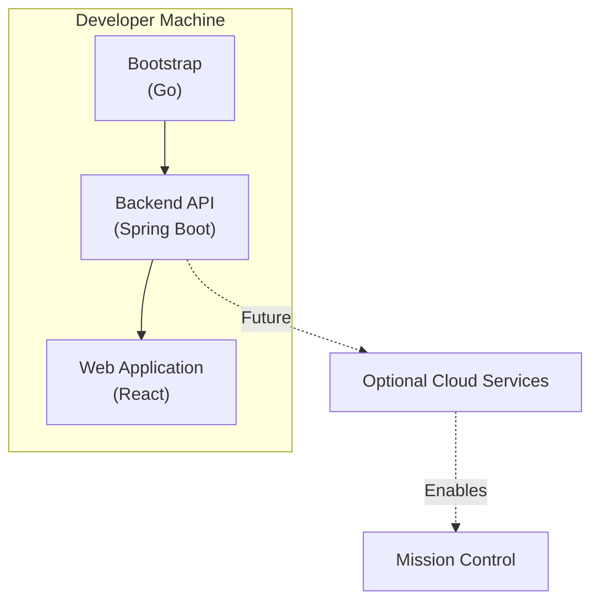

# Concept

## Motivation

This project started as a small helper inside another repository where I was experimenting with using OpenAI Codex as part of my everyday development workflow.

At first, I just wanted Codex to be easy to use. I wanted a development environment that already had the tools I needed, a curated view of the repository instead of unrestricted access, and a place to keep project-specific instructions, tasks, and configuration. As I kept using it, I added more pieces that made the workflow smoother, like initialization logic, reusable tasks, hooks, and a few guardrails.

The turning point came when I started another project and realized I was about to copy almost everything over. The runtime stayed the same, while only the project instructions, tasks, and workspace changed. That made it clear this had grown beyond being just another folder in a repository.

This project is simply giving that shared foundation its own home. Instead of rebuilding the same setup for every project, I want one place where I can improve it over time and reuse it wherever I need it.

## Core Idea

The core idea is to separate the infrastructure required to run AI-assisted development sessions from the parts that belong to an individual project.

The reusable pieces, such as the development environment, bootstrap process, persistent state, and common tasks and hooks, should live in one place instead of being copied into every repository.

Each project should only describe its own context by defining the workspace, providing project-specific instructions, and extending the shared behavior where needed.

As I use Mipe across more projects, I expect the shared foundation to grow naturally. New functionality should exist because multiple projects benefit from it, not because it might be useful someday.

## Evolution

While exploring the direction of the project, I started looking beyond the bootstrap itself and at the broader workflow of AI-assisted software development.

As I learned more about Codex, particularly its runtime model, skills, and workflow capabilities, it became clear that the original concept could grow into something more general than a reusable development kit. The bootstrap remained an important building block, but it was no longer the entire project.

Rather than focusing solely on starting AI coding sessions, the vision expanded toward providing a reusable foundation for AI-assisted software engineering. Running a session is only the beginning; preserving and revisiting the work produced during those sessions is an equally important part of the developer experience.

The project was therefore renamed to **Mipe**, while preserving the original principles that inspired it: separate reusable infrastructure from project-specific context, build from real experience, and keep the foundation simple enough to evolve naturally.

## Future Exploration

While Mipe begins with a reusable bootstrap for AI-assisted development, I expect the platform to grow beyond session initialization over time.

The first step is a dedicated Go bootstrap responsible for preparing the development environment and launching Codex. Once a session is running, a local backend captures and exposes session data, providing a bridge between Codex and the web application while establishing the foundation for future capabilities.

The initial focus of the web application is the **Developer Journal**. It provides insight into the current development session while allowing developers to revisit previous sessions through transcripts, usage statistics, summaries, and notes. Over time, the web application can grow to expose additional local capabilities without changing its underlying architecture.

Mission Control represents a future evolution of the platform rather than a standalone component. It builds upon the same local foundation by introducing broader visibility, collaboration, and optional cloud-backed capabilities while preserving Mipe's local-first philosophy.

Here is how I see the current architectural direction:

The architecture is designed around a local-first workflow. Developers should be able to use Mipe entirely on their own machine, while optional cloud services can extend the local experience without becoming a requirement.

These ideas are directions rather than commitments and will continue to evolve through experimentation and practical experience.
