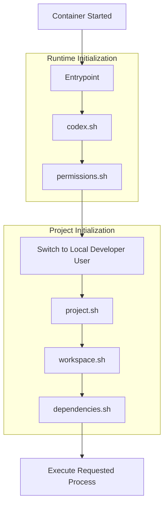
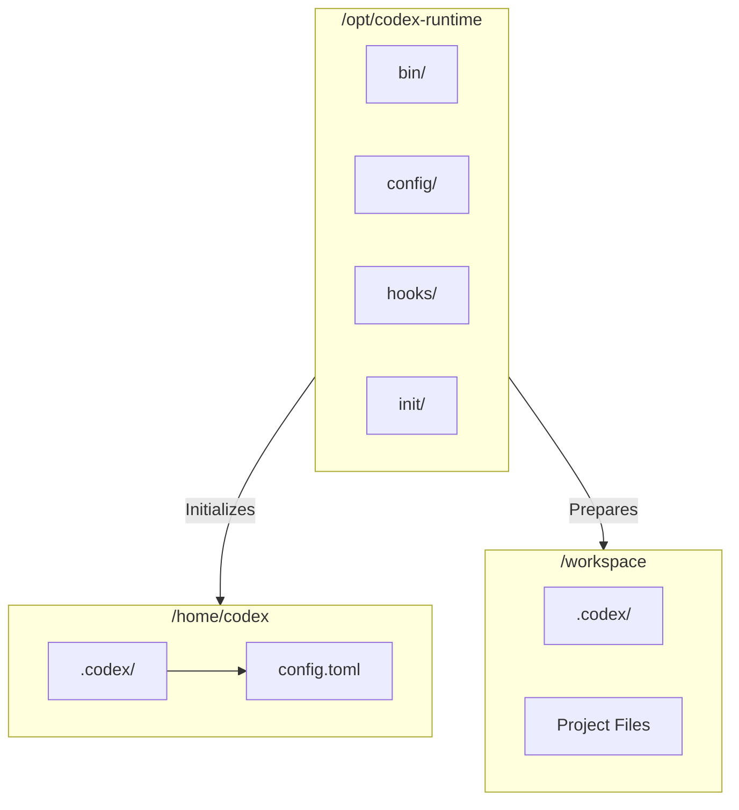
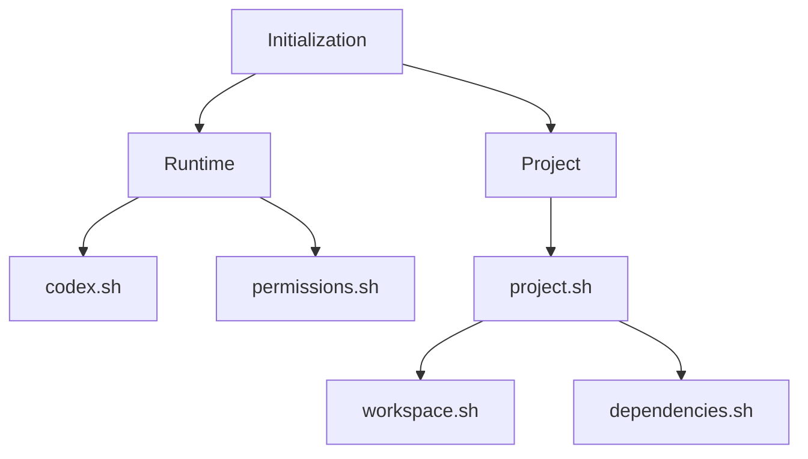

# Implementation

## Lifecycle

The runtime initializes itself, prepares the project, and then hands control over to the requested process.

## Environment

The runtime uses three directories, each with a distinct responsibility.

### Home Directory

The runtime uses `/home/codex` as the home directory for the developer process. It is backed by a persistent Docker volume so that Codex configuration, authentication state, and other user data survive container recreation.

The home directory is provided through the `HOME` environment variable. During runtime initialization, the Devkit prepares `~/.codex` and installs the shared runtime configuration.

Codex state paths are derived from `HOME`, making it the single source of truth for persistent runtime state.

### Runtime Directory

The runtime is installed under `/opt/codex-runtime` and contains the Devkit implementation, including the entrypoint, initialization scripts, shared configuration, and runtime hooks.

Unlike the home directory and workspace, it is part of the container image and treated as read-only during normal operation.

### Workspace

The workspace is mounted at `/workspace` and contains the project being developed. It is provided by the consuming project and serves as the primary working directory throughout development.

During project initialization, the workspace is treated as project-owned before invoking any project-specific initialization.

## Initialization

Initialization consists of two phases. Runtime initialization executes as the container's root user, while project initialization executes as the local developer user.

`codex.sh` prepares the Codex runtime, while `permissions.sh` updates ownership of the home directory before switching to the local developer user.

`project.sh` orchestrates project initialization by invoking `workspace.sh` for shared workspace initialization and `dependencies.sh` to invoke `/workspace/.codex/init/dependencies.sh` when provided by the consuming project.

## Configuration

The runtime provides a shared Codex configuration that is installed during runtime initialization and applied consistently across all projects.

- **`AGENTS.md`** establishes the shared identity and behavior for Codex
- **`config.toml`** establishes the default Codex configuration
- **`hooks/`** provides runtime hooks that extend Codex with Devkit-specific behavior and are registered through the shared configuration

## Handoff

Once initialization is complete, the runtime switches to the local developer user and executes the requested process.

From this point onward, the runtime performs no additional work. All commands, including the Codex CLI, execute with access to the prepared home directory, project workspace, and shared runtime configuration.
