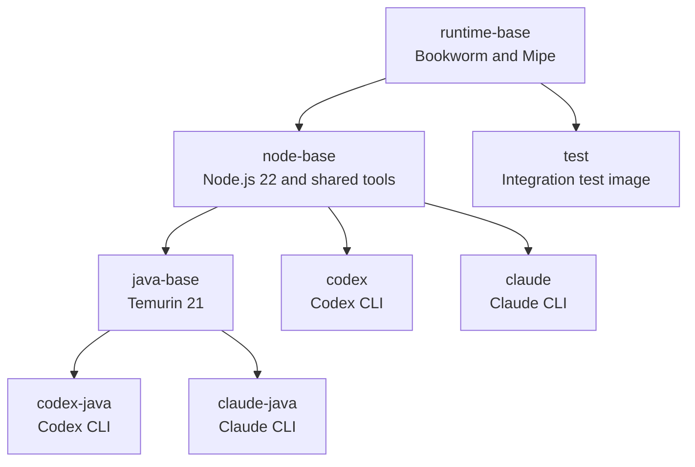
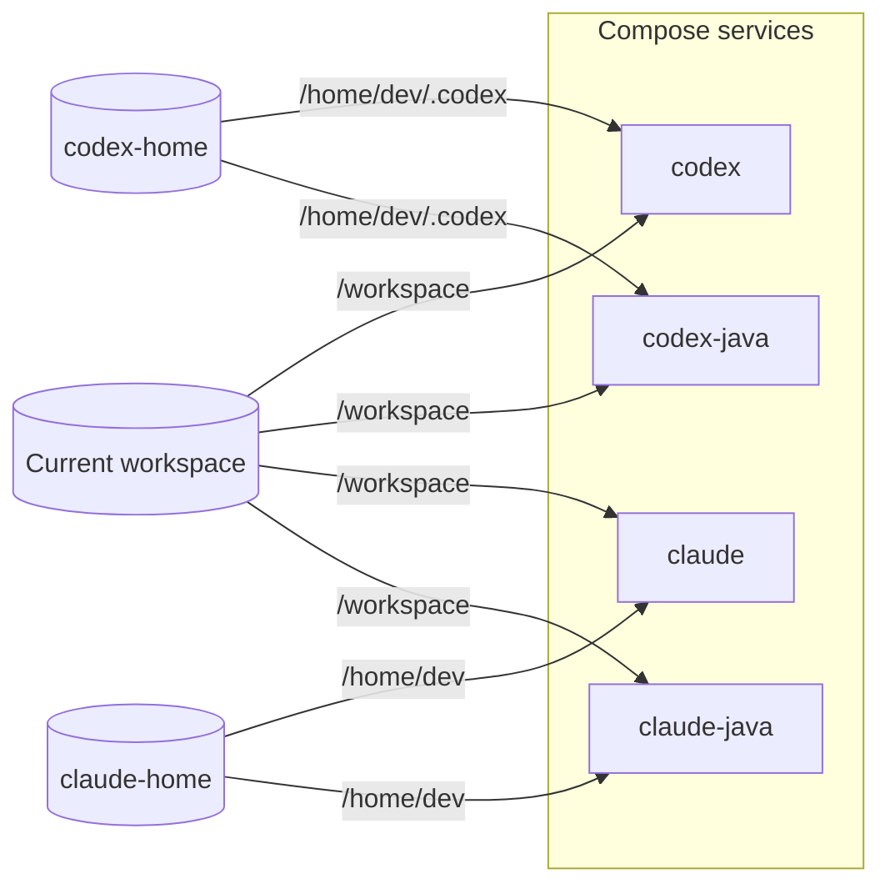

# Local Deployment

Mipe runs AI agents locally. Buildx Bake builds the images, Compose runs them against the workspace, and Just provides the common commands.

Runnable images:

| Image                             | Agent  | Toolchain                 |
|-----------------------------------|--------|---------------------------|
| `mipe-runtime-codex:latest`       | Codex  | Node.js 22                |
| `mipe-runtime-claude:latest`      | Claude | Node.js 22                |
| `mipe-runtime-codex-java:latest`  | Codex  | Node.js 22 and Temurin 21 |
| `mipe-runtime-claude-java:latest` | Claude | Node.js 22 and Temurin 21 |

## Building Images

Build the complete local image set with:

```bash
just build-images
```

This builds the test image and all four agent images.

To build only one or more agent variants, pass their Bake target names:

```bash
just build-images codex
just build-images claude-java
just build-images codex codex-java
```

### Build Architecture

The hierarchy keeps agent updates scoped to the affected images.



Base targets provide Mipe, Node.js, and Java. Agent targets add their CLI and configuration.

Changes rebuild:

- Updating Codex rebuilds only Codex images
- Updating Claude rebuilds only Claude images
- Updating Java rebuilds only Java images
- Updating Node.js rebuilds all agent images
- Updating Mipe runtime rebuilds the entire hierarchy

### Versions

`docker-bake.hcl` defines the default Node.js, Codex, and Claude versions. Override one for a local build with:

```bash
CODEX_VERSION=0.144.5 just build-images codex codex-java
CLAUDE_VERSION=2.1.211 just build-images claude claude-java
NODE_VERSION=22.23.1 just build-images codex claude codex-java claude-java
```

To inspect the resolved targets, versions, and dependencies before building, run:

```bash
docker buildx bake --print
```

## Running Agents

Choose the service for the agent and toolchain you need.



Every service mounts the workspace at `/workspace`. Codex and Claude keep separate agent state; each agent's standard and Java variants share it.

### Starting Agents

Run an agent with a Just recipe:

```bash
just codex-run
just claude-run
just codex-java-run
just claude-java-run
```

Or use Compose directly:

```bash
docker compose run --rm codex
docker compose run --rm claude-java
```

### Opening Shells

Open a Mipe-initialized agent shell with:

```bash
just codex-shell
just claude-shell
```

Inspect a Java image with:

```bash
just codex-java-shell
just claude-java-shell
```

Java shell recipes bypass Mipe startup and are for image inspection only.

## Container Startup

### Startup Sequence

Mipe startup:

1. The container entrypoint reads `LOCAL_UID` and `LOCAL_GID` and creates the local `dev` user
2. Mipe loads the agent configuration
3. Shared configuration is copied into the agent home
4. If the workspace contains `.mipe/init/dependencies.sh`, Mipe runs it
5. Mipe switches from root to the local user and starts the requested process in `/workspace`

### User Identity

Compose defaults both IDs to `1000`. Check your host IDs with:

```bash
id -u
id -g
```

If either value is different, override it when starting a service:

```bash
docker compose run --rm \
    -e LOCAL_UID="$(id -u)" \
    -e LOCAL_GID="$(id -g)" \
    codex
```

Matching IDs lets the agent modify workspace files without creating root-owned files.

## Troubleshooting

### Missing Images

Build the requested target and try again:

```bash
just build-images codex-java
just codex-java-run
```

### Workspace Permissions

Check that `LOCAL_UID` and `LOCAL_GID` match your host user and that the workspace is writable.

Mipe stops before starting the agent if `/workspace` is missing or not writable for the configured user.

### Outdated Images

Rebuild the affected Bake target:

```bash
just build-images claude-java
```

### Agent State

List Mipe agent volumes with:

```bash
docker volume ls --filter name=mipe_
```

To reset all local agent state, remove Mipe volumes:

```bash
just docker-clean-volumes
```

This deletes agent authentication, settings, and caches, but not the workspace.
