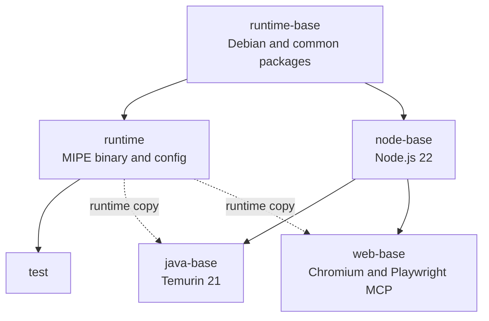
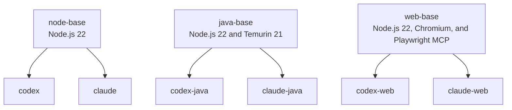
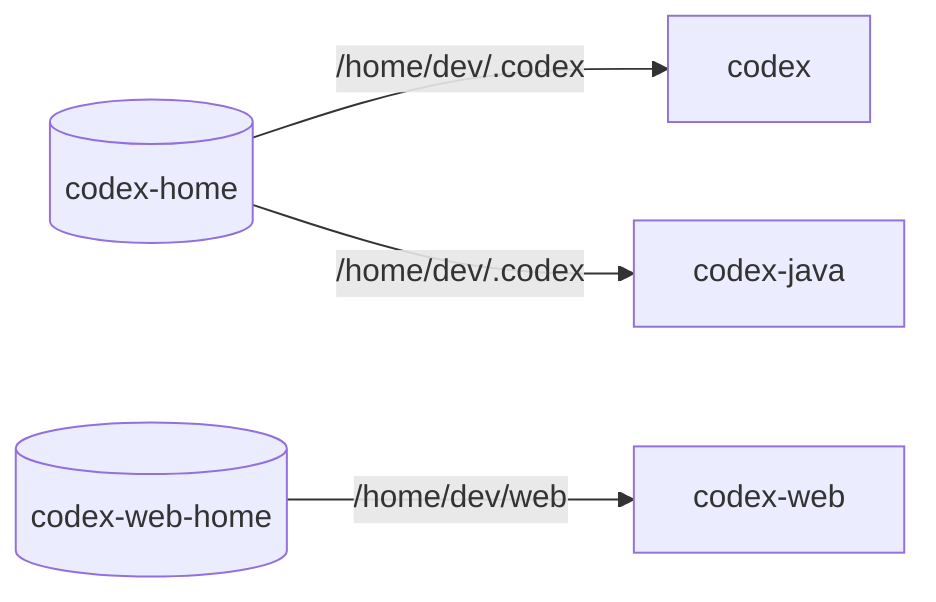
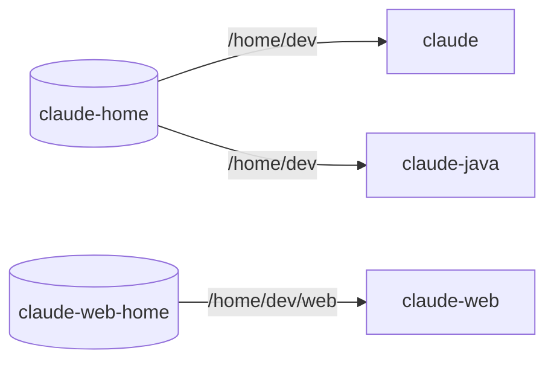

# Local Deployment

Mipe runs AI agents locally. Buildx Bake builds the images, Compose runs them against the workspace, and Just provides the common commands.

Runnable images:

| Image                             | Agent  | Toolchain                                |
|-----------------------------------|--------|------------------------------------------|
| `mipe-runtime:local`              | Mipe   | Base runtime                             |
| `mipe-runtime-test:local`         | Mipe   | Test runtime                             |
| `mipe-runtime-codex:local`        | Codex  | Node.js 22                               |
| `mipe-runtime-claude:local`       | Claude | Node.js 22                               |
| `mipe-runtime-codex-java:local`   | Codex  | Node.js 22 and Temurin 21                |
| `mipe-runtime-claude-java:local`  | Claude | Node.js 22 and Temurin 21                |
| `mipe-runtime-codex-web:local`    | Codex  | Node.js 22, Chromium, and Playwright MCP |
| `mipe-runtime-claude-web:local`   | Claude | Node.js 22, Chromium, and Playwright MCP |

## Building Images

Build the complete local image set with:

```bash
just build-images
```

This builds the runtime image, test image, and all six agent images.

To build only one or more agent variants, pass their Bake target names:

```bash
just build-images codex
just build-images claude-java
just build-images codex codex-java
```

### Build Architecture

Base targets provide shared Debian, Node.js, Java, and web tooling. Java and web bases add MIPE runtime after installing dependencies. Standard agent images add it after installing agent packages.

### Shared Foundations



### Agent Variants

All agent images include MIPE runtime. Standard variants combine it with `node-base`; Java and web variants inherit it from their base image.



### Versions

`docker-bake.hcl` defines the default Node.js, Codex, Claude, and Playwright MCP versions. Override one for a local build with:

```bash
CODEX_VERSION=0.144.5 just build-images codex codex-java
CLAUDE_VERSION=2.1.211 just build-images claude claude-java
NODE_VERSION=22.23.1 just build-images codex claude codex-java claude-java codex-web claude-web
PLAYWRIGHT_MCP_VERSION=0.0.78 just build-images codex-web claude-web
```

To inspect the resolved targets, versions, and dependencies before building, run:

```bash
docker buildx bake --print
```

The build uses a fixed `SOURCE_DATE_EPOCH` from `docker-bake.hcl`. It must not be derived from the current commit, because changing layer timestamps would produce different image digests for otherwise identical layers.

The MIPE build version is computed from `go.mod`, `go.sum`, and production Go files under `cmd/` and `internal/`. Test files are excluded from both the version hash and the Docker build context, so test-only changes do not invalidate the runtime binary layer.

## Running Agents

Choose the service for the agent and toolchain you need.

Every service mounts the current workspace at `/workspace`.

### Codex State



### Claude State



Standard and Java variants share agent state. Web variants use separate state volumes.

### Starting Agents

Run an agent with a Just recipe:

```bash
just codex
just claude
just codex-java
just claude-java
just codex-web
just claude-web
```

Or use Compose directly:

```bash
docker compose run --rm codex
docker compose run --rm claude-java
```

### Opening Shells

Open a Mipe-initialized agent shell by passing `mipe bash` to the image recipe:

```bash
just codex mipe bash
just claude mipe bash
just codex-java mipe bash
just claude-java mipe bash
just codex-web mipe bash
just claude-web mipe bash
```

## Container Startup

### Startup Sequence

Mipe startup:

1. The container entrypoint reads `LOCAL_UID` and `LOCAL_GID` and creates the local `dev` user
2. Mipe loads the agent configuration
3. Mipe validates the configuration and workspace permissions
4. Shared configuration is copied into the agent home
5. If the workspace contains `.mipe/init/dependencies.sh`, Mipe runs it
6. Mipe switches from root to the local user and starts the requested process in `/workspace`

### User Identity

Compose defaults both IDs to `1000`. Check your host IDs with:

```bash
id -u
id -g
```

If either value is different, override it when starting a service:

```bash
docker compose run --rm \
    -e LOCAL_UID="$(id -u)" \
    -e LOCAL_GID="$(id -g)" \
    codex
```

Matching IDs lets the agent modify workspace files without creating root-owned files.

> [!WARNING]
> Mismatched `LOCAL_UID` or `LOCAL_GID` can create workspace files the host user cannot modify.

## Troubleshooting

### Missing Images

Build the requested target and try again:

```bash
just build-images codex-java
just codex-java
```

### Workspace Permissions

Check that `LOCAL_UID` and `LOCAL_GID` match your host user and that the workspace is writable.

Mipe stops before starting the agent if `/workspace` is missing or not writable for the configured user.

### Outdated Images

Rebuild the affected Bake target:

```bash
just build-images claude-java
```

### Agent State

List Mipe agent volumes with:

```bash
docker volume ls --filter name=mipe_
```

To reset all local agent state, remove Mipe volumes by running from root:

> [!WARNING]
> This permanently removes agent authentication, settings, and caches.

```bash
just docker-clean-volumes
```

Workspace is not removed.
