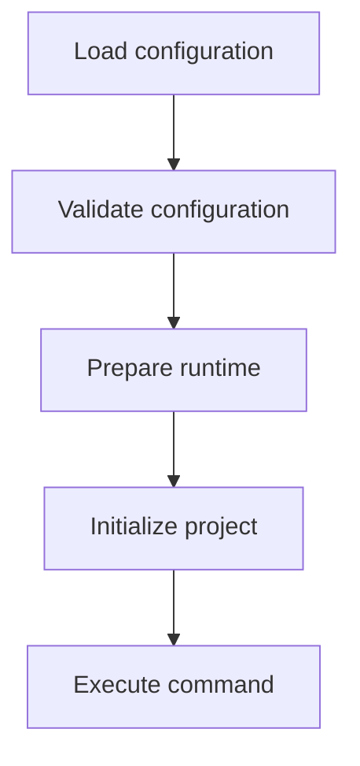

# Implementation

## Configuration

The bootstrap is configured before execution begins. Its configuration describes the environment in which the bootstrap will run, including where the runtime is installed, where the project workspace is located, which agent is being initialized, and which user should own the resulting files.

Configuration can be provided through a configuration file and overridden by environment variables. This allows a single bootstrap binary to be reused across different environments while still supporting environment-specific customization.

Example configuration file:

```json
{
  "agent_name": "codex",
  "user_home": "/home/dev",
  "agent_home": "/home/dev/.codex",
  "runtime_home": "/opt/codex-runtime",
  "workspace": "/workspace",
  "local_uid": "1000",
  "local_gid": "1000"
}
```

If no configuration path is provided, the bootstrap loads `/opt/mipe/config.json`.

The bootstrap itself is invoked with configuration flags followed by the command that should be executed once initialization is complete.

```bash
mipe --config /opt/codex-runtime/config.json codex
```

Configuration from the file is loaded first, then overridden by matching environment variables. The resulting configuration is validated before the bootstrap lifecycle begins. If any required values are missing or invalid, execution terminates immediately without modifying the runtime environment.

The user home is configured through `user_home` or the `USER_HOME` environment variable. The bootstrap ignores its own `HOME` environment variable when resolving this value, preventing the container environment from implicitly changing the agent home directory.

## Bootstrap Lifecycle

The bootstrap follows a fixed sequence of phases. Each phase receives the validated configuration and must complete before the next phase starts.



If any phase fails, the bootstrap terminates immediately.

## Runtime Preparation

The runtime consists of the shared files that Mipe provides to every project. These files define the agent's behavior and configuration independently of the consuming project.

The bootstrap begins execution as the container's root user so it can perform privileged operations such as creating directories, copying the shared runtime, and updating file ownership. Once preparation is complete, project initialization and the final command execute as the local developer user, ensuring that project code never runs with elevated privileges.

During preparation, the bootstrap creates the configured agent home directory:

```text
<agent_home>
```

It then copies the shared runtime from:

```text
<runtime_home>/config
```

into the agent home, making it available to the agent before execution begins.

If agent home is not configured, this directory creation and shared runtime copy are skipped.

Finally, the bootstrap updates ownership of the configured user home directory using the configured user and group identifiers. Without this step, the local developer user would not be able to modify files created during preparation, preventing both project initialization and normal development.

## Project Initialization

Project initialization allows the consuming project to perform its own setup after the shared runtime has been prepared. Unlike the runtime itself, this step is entirely project-specific and remains local to the workspace.

The bootstrap looks for the following initialization script:

```text
<workspace>/.mipe/init/dependencies.sh
```

If the script is present, it is executed as the local developer user. If it is absent, the bootstrap simply continues to the next phase.

The configured workspace must already exist as a writable directory for the local developer user. Project initialization runs from this directory. The bootstrap does not copy or relocate project files into the workspace.

The script is expected to define an `install_dependencies` function, allowing each project to install its own dependencies without the runtime needing to understand project-specific tooling or package managers.

## Process Execution

Process execution marks the end of the bootstrap lifecycle. At this point, the runtime has been prepared and the project has completed any required initialization. The bootstrap's responsibility is complete.

Before launching the requested command, the bootstrap constructs the environment expected by the agent. This includes the standard home directory, the runtime location, and an agent-specific home directory. The configured user home is exported as `HOME`; `USER_HOME` remains internal to the bootstrap and is not exposed to the agent.

The agent home is where the agent stores its own persistent state, such as configuration, authentication, caches, and other runtime-managed files. This is distinct from the workspace, which contains the project being developed together with any project-specific configuration. By separating these responsibilities, the same agent can be reused across multiple projects while maintaining a consistent runtime environment.

The agent home environment variable is `AGENT_HOME` when agent home is configured.

Once the environment has been prepared, the bootstrap changes to the configured workspace and replaces itself with the requested command. From this point onward, the requested application becomes the primary process and the bootstrap no longer participates in execution.

## Runtime Layout

The bootstrap works with three distinct locations, each serving a different purpose.

```text
<runtime_home>/
  config/
    AGENTS.md
    config.toml

<user_home>/

<agent_home>/
  AGENTS.md
  config.toml

<workspace>/
  .mipe/
    init/
      dependencies.sh
```

- **Runtime** contains the shared configuration provided by Mipe. It is read-only from the perspective of the bootstrap and serves as the source for agent initialization
- **Agent home** contains the prepared runtime for a specific agent together with any persistent state managed by that agent
- **Workspace** contains the project being developed and any project-specific initialization provided by the consuming project

During preparation, the bootstrap copies the shared runtime configuration from `<runtime_home>/config` into agent home. The workspace is never modified by runtime itself, except through optional project initialization.
